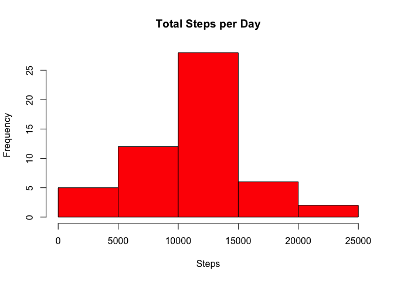
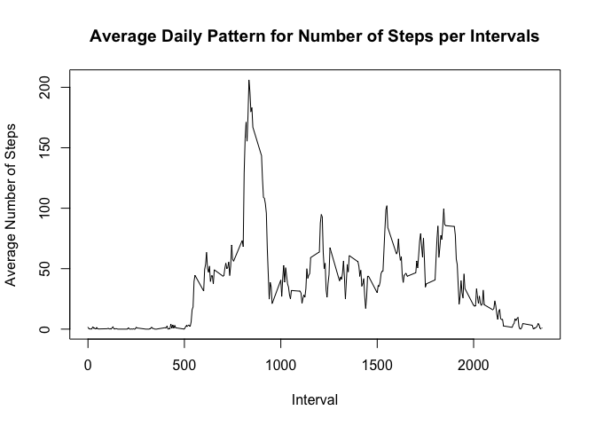
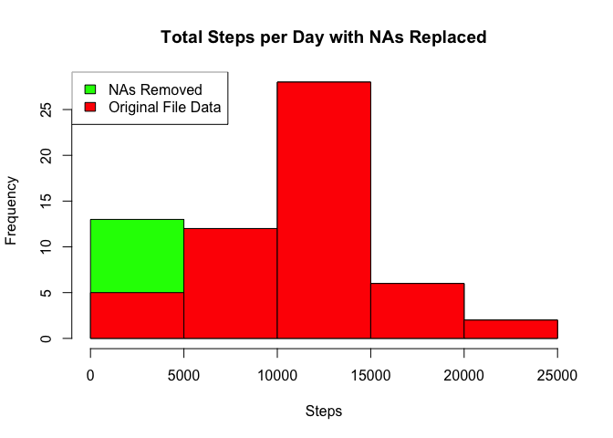
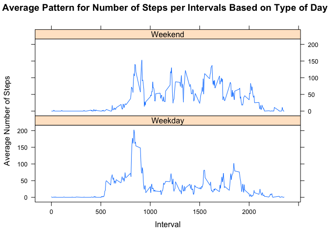

```r
require("knitr")
```

```
## Loading required package: knitr
```

```r
knitr::opts_chunk$set(echo = TRUE)
opts_knit$set(root.dir = "~/Documents/Data Science/Reproducible Research/Week 2")
```

## Personal Activity Monitoring Device Data Analysis

It is now possible to collect a large amount of data about personal movement using activity monitoring devices such as a Fitbit, Nike Fuelband, or Jawbone Up. These type of devices are part of the “quantified self” movement – a group of enthusiasts who take measurements about themselves regularly to improve their health, to find patterns in their behavior, or because they are tech geeks. But these data remain under-utilized both because the raw data are hard to obtain and there is a lack of statistical methods and software for processing and interpreting the data.

This assignment makes use of data from a personal activity monitoring device. This device collects data at 5 minute intervals through out the day. The data consists of two months of data from an anonymous individual collected during the months of October and November, 2012 and include the number of steps taken in 5 minute intervals each day.

Load Libraries

```r
library(ggplot2)
library(dplyr)
```

```
## 
## Attaching package: 'dplyr'
```

```
## The following objects are masked from 'package:stats':
## 
##     filter, lag
```

```
## The following objects are masked from 'package:base':
## 
##     intersect, setdiff, setequal, union
```

```r
library(plyr)
```

```
## -------------------------------------------------------------------------
```

```
## You have loaded plyr after dplyr - this is likely to cause problems.
## If you need functions from both plyr and dplyr, please load plyr first, then dplyr:
## library(plyr); library(dplyr)
```

```
## -------------------------------------------------------------------------
```

```
## 
## Attaching package: 'plyr'
```

```
## The following objects are masked from 'package:dplyr':
## 
##     arrange, count, desc, failwith, id, mutate, rename, summarise,
##     summarize
```

```r
library(lubridate)
```

```
## 
## Attaching package: 'lubridate'
```

```
## The following object is masked from 'package:plyr':
## 
##     here
```

```
## The following object is masked from 'package:base':
## 
##     date
```

```r
library(lattice)
```

Get and setup the data

```r
## Setup working directory
setwd("~/Documents/Data Science/Reproducible Research/Week 2")

## Create the subdirectory "data" if not already found.
if(!file.exists("./Data")){dir.create(".Week 2")}
setwd("~/Documents/Data Science/Reproducible Research/Week 2")

## File Download
## Assign the file link/ location to fileUrl.
fileUrl <- "https://d396qusza40orc.cloudfront.net/repdata%2Fdata%2Factivity.zip"
## Download the file
download.file(fileUrl,destfile="./Dataset.zip",method="curl")

## Unzip the file contents into the data subdirectory.
unzip(zipfile="./Dataset.zip",exdir="./Week 2")

## Table load
PA1 <-read.csv("activity.csv", header=TRUE, sep=",", na.strings = "NA")
## Create a clone of the orginal
PA1clone <- PA1
```

Transform the data

```r
PA1$day <- weekdays(as.Date((PA1$date)))
PA1$DateTime <- as.POSIXct(PA1$date, format = "%Y-%m-%d")

## Omit the NAs
PA2 <- na.omit(PA1)
```

###What is the mean total number of steps taken per day?

```r
## Sort the Data by date - make sure data is in right order ##
PA2 <- arrange(PA2, PA2$DateTime)
## Aggregate Data by date ##
PA2summary <- aggregate(PA2$steps ~ PA2$date, FUN=sum)
```

Make a histogram depicting the total number of steps taken each day

```r
hist(as.numeric(PA2summary$`PA2$steps`), col="Red", main="Total Steps per Day", xlab="Steps", ylab="Frequency")
```

<!-- -->

Calculate and report the mean and median of the total number of steps taken per day

```r
stepsmean <- as.integer(mean(PA2summary$`PA2$steps`))
stepsmedian <- as.integer(median(PA2summary$`PA2$steps`))
```

The mean of the total number of steps per day is **10766**, and the median of the total number of steps is **10765**.

###What is the average daily activity pattern?
Make a time series plot (i.e. type="l") of the 5-minute interval (x-axis) and the average number of steps taken, averaged across all days (y-axis)


```r
## Group the data by intervals
##PA3summary <- group_by(PA2, PA2$interval)

## Summarize the data by steps
PA3summary <- aggregate(PA2$steps ~ PA2$interval, FUN=mean)

## Plot the data
plot(PA3summary$`PA2$interval`, PA3summary$`PA2$steps`, type="l", xlab= "Interval", ylab="Average Number of Steps", 
     main = "Average Daily Pattern for Number of Steps per Intervals")
```

<!-- -->

Which 5-minute interval, on average across all the days in the dataset, contains the maximum number of steps?

```r
PA3summary <- round(PA3summary, 0)
maxSteps <- max(PA3summary$`PA2$steps`)
maxInterval <- as.numeric(PA3summary[PA3summary$`PA2$steps`==maxSteps, 1])
```

The 5-minute interval, on average across all the days in the dataset is **835**, and contains the maximum number of **206** steps.

###Imputing missing values
Note that there are a number of days/intervals where there are missing values (coded as NA). The presence of missing days may introduce bias into some calculations or summaries of the data.

Calculate and report the total number of missing values in the dataset (i.e. the total number of rows with NAs).

```r
PA1NAcount <- as.numeric(sum(is.na(PA1)))
```
The total number of rows with missing values in the PA1 dataset is **2304**.

Devise a strategy for filling in all of the missing values in the dataset. The strategy does not need to be sophisticated. For example, you could use the mean/median for that day, or the mean for that 5-minute interval, etc.

My approach will be to fill in the NA values with the table mean of the 5 minute interval

```r
## Mean for the 5 minute interval
PA45minutemean <- filter(PA1, interval == 5, !is.na(steps))
PA45minutemeanvalue <- round(mean(PA45minutemean$steps), 0)

## Segregate all of the NA in the PA4nada table
PA4nadata <- PA1[is.na(PA1$steps),]

## Replace the NAs with the mean of the 5 minute interval
PA4nadata[is.na(PA4nadata)] <- PA45minutemeanvalue
```

Create a new dataset that is equal to the original dataset but with the missing data filled in.

```r
## Replace the NAs with the mean of the 5 minute interval
PA1clone[is.na(PA1clone)] <- PA45minutemeanvalue

## Output a small sample
head(PA1clone)
```

```
##   steps       date interval
## 1     0 2012-10-01        0
## 2     0 2012-10-01        5
## 3     0 2012-10-01       10
## 4     0 2012-10-01       15
## 5     0 2012-10-01       20
## 6     0 2012-10-01       25
```

Make a histogram of the total number of steps taken each day and Calculate and report the mean and median total number of steps taken per day. Do these values differ from the estimates from the first part of the assignment? What is the impact of imputing missing data on the estimates of the total daily number of steps?

```r
## Sort the Data by date - make sure data is in right order ##
PA1clone <- arrange(PA1clone, PA1clone$date)
## Aggregate Data by date ##
PA1clonesummary <- aggregate(PA1clone$steps ~ PA1clone$date, FUN=sum)

## Rename the columns
names(PA1clonesummary)[1]<-"date"
names(PA1clonesummary)[2]<-"steps"

## Plot the histogram

hist(PA1clonesummary$steps, col="green", main="Total Steps per Day with NAs Replaced", xlab="Steps", ylab="Frequency")
hist(PA2summary$`PA2$steps`, col="Red", xlab="Steps", ylab="Frequency", add=T)
legend("topleft", c("NAs Removed", "Original File Data"), fill=c("green", "red"))
```

<!-- -->

Calculate and report the mean and median of the total number of steps taken per day with NAs replaced

```r
stepsmean1 <- as.integer(mean(PA1clonesummary$steps))
stepsmedian1 <- as.integer(median(PA1clonesummary$steps))

## Compute the difference
stepsmeandelta <- stepsmean - stepsmean1 
stepsmediandelta <- stepsmedian - stepsmedian1

# Compute the % change
stepsmeandeltapercent <- as.integer((stepsmeandelta / stepsmean) * 100) 
stepsmediandeltapercent <- as.integer((stepsmediandelta / stepsmedian) * 100) 
```

The new mean of the total number of steps per day is **9354**, as compared to the original mean of **10766**. The new median of the total number of steps is **10395**, as compared to the original median of **10765**.
The mean difference in steps is **1412** and the median difference in steps is **370**.

We observe a notable impact in the freqency of the 0 - 500 scale in this histogram, with no change in the distribution from the 500 to 25,000 range. Or a **13**% change in mean and **3**% change in median.

###Are there differences in activity patterns between weekdays and weekends?
For this part the  function may be of some help here. Use the dataset with the filled-in missing values for this part.

Create a new factor variable in the dataset with two levels – “weekday” and “weekend” indicating whether a given date is a weekday or weekend day.

```r
## Convert date factor to date
PA1clone$date <- ymd(PA1clone$date)

## Mutate a column with the weekday name
PA1clone <- mutate(PA1clone, weekday = weekdays(date))

## Add a new column that specifies the type of day - weekend or weekday based on weekday clumn
PA1clone$daytype <- ifelse(PA1clone$weekday %in% c("Saturday", "Sunday"), "Weekend", "Weekday")

## output a sample of the data
head(PA1clone)
```

```
##   steps       date interval weekday daytype
## 1     0 2012-10-01        0  Monday Weekday
## 2     0 2012-10-01        5  Monday Weekday
## 3     0 2012-10-01       10  Monday Weekday
## 4     0 2012-10-01       15  Monday Weekday
## 5     0 2012-10-01       20  Monday Weekday
## 6     0 2012-10-01       25  Monday Weekday
```

Make a panel plot containing a time series plot (i.e. type = "l" ) of the 5-minute interval (x-axis) and the average number of steps taken, averaged across all weekday days or weekend days (y-axis).

```r
## summarize the data by daytype, intervals and draw the average for steps
PA1cloneplot <- ddply(PA1clone, .(interval, daytype), summarize, mean = as.integer(mean(steps)))

##  Panel Plot the data
xyplot(mean ~ interval|daytype, data=PA1cloneplot, type="l",  layout = c(1,2),
       main="Average Pattern for Number of Steps per Intervals Based on Type of Day", 
       ylab="Average Number of Steps", xlab="Interval")
```

<!-- -->


